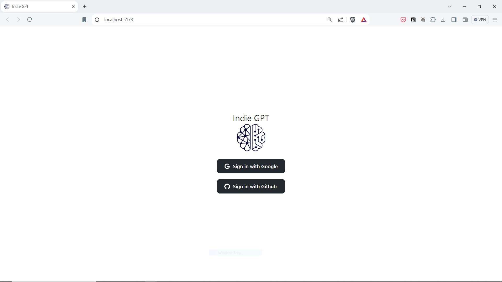
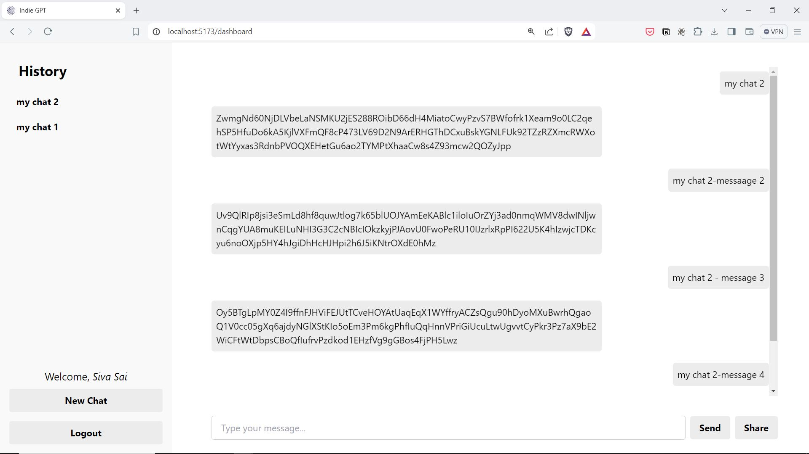
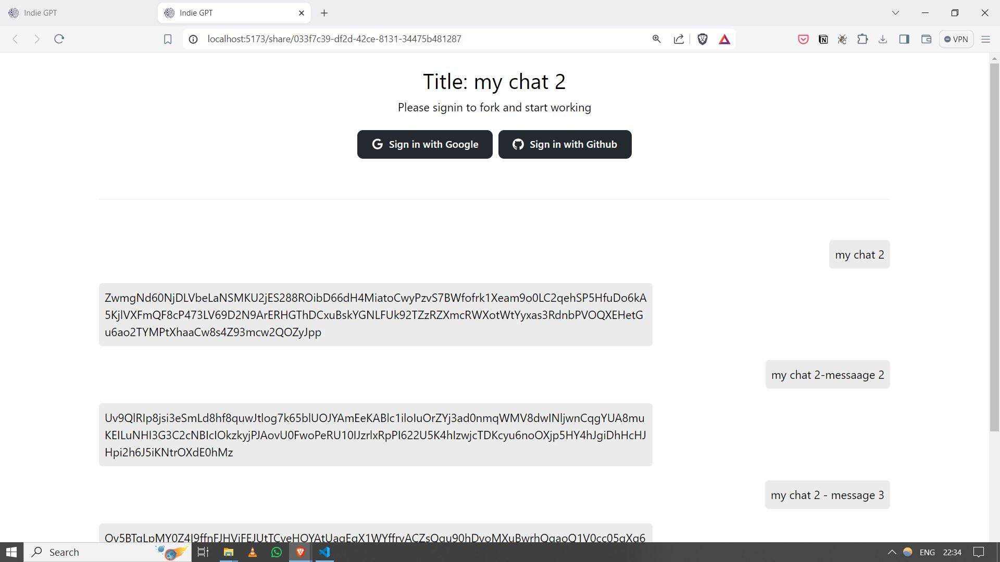

# Indie GPT
A full stack application which allows users to demonstrate an interactive chatbot application with chat sharing, forking features.

## Techstack used: 
- React
- Redux
- Firebase
- Tailwindcss
- FastAPI
- SQLAlchemy
- SQLite
- Vercel

## Application features
- Google Login
- Github Login
- Multiple conversations
- Share conversation
- Fork public conversation and continue

## Demo

### Login Page

### Dashboard Page

### Shared Chat Page

https://github.com/ysskrishna/crew-recruiting-chatbot-app/assets/26503640/0e27b438-614c-4b12-b81c-69c36fdc94bc

<video width="320" height="240" controls>
  <source src="./media/indiegpt.mp4" type="video/mp4">
</video>

### Backend Documentation
For backend, please go through the `backend/README.md` file

### Frontend Documentation
For frontend, please go through the `client/README.md` file
